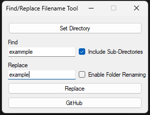

## Find/Replace Tool
About:
* This program is designed to give a simple, easy, and fast method of mass file renaming when you need to replace or add to text in a filename
* Quick Search & Replace: Effortlessly find and replace text within file names. Perfect for batch renaming multiple files in seconds.
* Subdirectory Support: Replace text in filenames not only in the current directory but also across all nested subdirectories.
* Case-Insensitive Matching: The tool allows for case-insensitive text replacement, ensuring no file is missed.
* User-Friendly Interface: Simple, intuitive design that requires no technical knowledge. Just a few clicks and your files are renamed.
